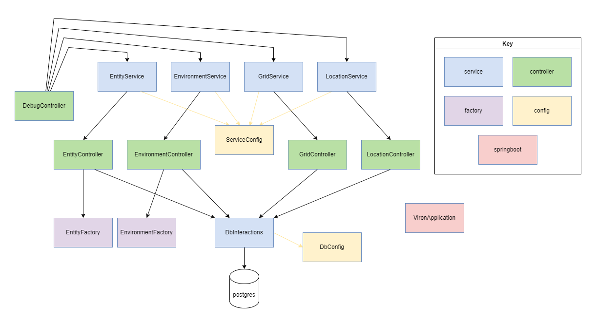

# Viron
This is a tool for creating and managing virtual environments and entities within those environments. This intended to be used for game development, but can be used for other purposes as well.



## Table of Contents
- [Definitions](#definitions)
    - [What is a virtual environment?](#what-is-a-virtual-environment)
- [Testing](#testing)
    - [Running the unit tests](#running-the-unit-tests)
    - [Postman](#postman)
- [Contributing](#contributing)
    - [Using the dev container](#using-the-dev-container)
- [Deployment](#deployment)
    - [Starting the application](#starting-the-application)
    - [Stopping the application](#stopping-the-application)

## Definitions
### What is a virtual environment?
A virtual environment is a space where entities can exist and interact with each other. This can be a 2D or 3D space, and can be as simple as a blank space or as complex as a fully realized world.

In Viron, a virtual environment is a 2D space where entities can exist and interact with each other. The environment is made up of a grid of cells, each of which can contain a number of entities. The behavior of the entities is up to the client application, which can define rules for how entities interact with each other and with the environment.

## Contributing
### Using the dev container
This project includes a dev container that you can use to develop and test the code in a consistent environment. To use the dev container, you will need to have Docker and Visual Studio Code installed on your machine. Once you have those installed, follow these steps:
1. Make sure the Dev Container extension is installed in Visual Studio Code.
2. Open the project in Visual Studio Code.
3. Click on the green "Open a Remote Window" button in the bottom left corner of the window.
4. Select "Reopen in Container" from the menu that appears.
5. Visual Studio Code will now build the dev container and open the project inside it.
6. You can now develop and test the code inside the dev container. Any changes you make will be reflected in the project on your local machine.

## Testing
### Running the unit tests
To run the unit tests, reopen the project in the dev container and run the following command:

```bash
mvn test
```

### Postman
To test the API, you can use the Postman collection provided in the `postman` directory. This collection contains a number of requests that you can use to interact with the API. See the [README](postman/README.md) in the `postman` directory for more information.

## Deployment
### Starting the application
To start the application, run the following command:

```bash
docker compose up --build -d
```

The application will be available at `http://localhost:8080`.

### Stopping the application
To stop the application, run the following command:

```bash
docker compose down
```